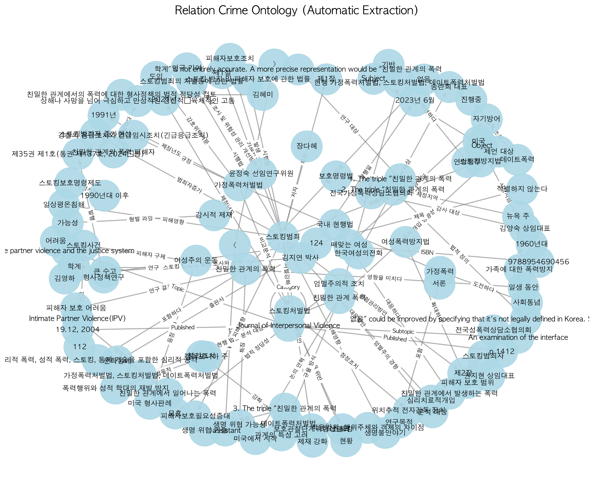

# Police RAG POC (Relation-based Knowledge Graph)

이 프로젝트는 경찰 관련 문서(치안 정책, 스토킹 처벌법 등)를 분석하여 **지식 그래프(Knowledge Graph)**를 구축하고, 이를 기반으로 질의응답을 수행하는 **GraphRAG(Retrieval-Augmented Generation)** 시스템의 개념 증명(POC) 프로젝트입니다.

## 1. 프로젝트 개요

- **목표**: 비정형 텍스트 데이터(PDF)에서 구조화된 지식(Entity, Relation)을 추출하여 온톨로지를 구축하고, 이를 통해 할루시네이션(Hallucination)을 줄이고 답변의 근거를 명확히 하는 RAG 시스템 검색 성능 향상.
- **핵심 기능**:
  - LLM을 활용한 문서 내 주어-서술어-목적어(Triple) 추출
  - NetworkX를 이용한 지식 그래프 구축 및 저장 (.gml)
  - 지식 그래프 시각화
  - 그래프 기반 문맥 검색 및 LLM 질의응답

## 2. 사용 모델 및 환경

이 프로젝트는 Apple Silicon(Mac) 환경에서 로컬 LLM을 구동하기 위해 **MLX** 프레임워크를 사용합니다.

- **모델**: `HyperCLOVAX-SEED-Think-32B-Text-4bit`
  - 원본 모델(32B)을 MLX 포맷으로 변환 후, 메모리 효율성을 위해 **4-bit 양자화(Quantization)**를 적용하여 약 17~18GB 메모리로 구동 가능하도록 최적화하였습니다.
- **하드웨어 요구사항**:
  - Apple M1/M2/M3 Max 또는 Ultra 권장 (최소 32GB 이상 통합 메모리 필요)
  - macOS 13.0 이상

## 3. 구축된 온톨로지 시각화

문서들로부터 추출된 관계 데이터는 다음과 같이 시각화됩니다.



## 4. 파일 구조

```
.
├── documents/                  # 분석 대상 PDF 문서 (스토킹 범죄, 친밀한 관계 폭력 등)
├── models/                     # MLX 포맷으로 변환된 LLM (4-bit 양자화 포함)
├── build_ontology.py           # 문서를 읽어 triples를 추출하고 지식 그래프(.gml) 생성
├── visualize_graph.py          # 구축된 지식 그래프를 시각화하여 이미지(.png) 저장
├── simple_graph_rag.py         # [메인] GraphRAG 질의응답 시스템 실행
├── crime_ontology.gml          # 생성된 지식 그래프 파일
└── crime_ontology_viz.png      # 시각화 결과물
```

## 5. 설치 및 실행 방법

### 가상환경 설정 및 라이브러리 설치
```bash
# 가상환경 생성 및 활성화
python -m venv .venv
source .venv/bin/activate

# 필수 라이브러리 설치 (예시)
pip install mlx-lm networkx matplotlib pdfplumber
```

### 1단계: 온톨로지 구축 (인덱싱)
PDF 문서를 분석하여 지식 그래프를 생성합니다.
```bash
python build_ontology.py
```

### 2단계: 그래프 시각화
생성된 그래프 구조를 이미지로 확인합니다.
```bash
python visualize_graph.py
```

### 3단계: GraphRAG 실행 (질의응답)
구축된 지식을 바탕으로 질문을 던지고 답변을 받습니다.
```bash
python simple_graph_rag.py
```

## 6. 질의응답 예시 (Actual Output)

사용자가 실제 질문했을 때의 시스템 작동 로그와 답변 예시입니다.

---

**Q1. 김영하가 누구야?**
> **[GraphX Log]**
> - Processing query: '김영하가 누구야?'
> - MATCH NODE: '김영하'
> - FOUND EDGE: 124 -> [저자] -> 김영하
>
> **[답변]**
> 김영하는 한국의 유명한 작가로, 다양한 소설과 에세이를 통해 많은 독자들에게 사랑받고 있습니다. (문맥: 124 -> [저자] -> 김영하)

**Q2. 스토킹범죄는 얼마나 심각해?**
> **[GraphX Log]**
> - MATCH NODE (fuzzy): '스토킹범죄'
> - FOUND EDGE: 스토킹범죄 -> [피해영향] -> 생명불안야기
> - FOUND EDGE: 스토킹범죄 -> [피해영향] -> 일상평온침해
> - FOUND EDGE: 스토킹범죄 -> [범죄자증가] -> 스토킹범죄자 증가현상
>
> **[답변]**
> 스토킹범죄는 피해자에게 일상의 평온을 침해하고 생명에 대한 불안을 야기할 정도로 심각합니다. 이에 따라 피해자 보호의 필요성이 증대되고 있으며, 스토킹 방지 및 피해자 보호에 관한 법률이 시행되고 있습니다.

**Q3. 감시적제재가 뭐야? (띄어쓰기 무시 검색)**
> **[GraphX Log]**
> - Normalized Search Query: '감시적제재가뭐야?'
> - MATCH NODE (fuzzy): '감시적 제재'
> - FOUND EDGE: 감시적 제재 -> [형벌 과잉] -> 가능성
>
> **[답변]**
> 감시적 제재는 특정한 행동이나 활동을 감시하거나 제한하는 조치를 의미합니다. 이는 형벌 과잉의 가능성을 내포할 수 있습니다.

**Q4. 여성폭력방지법이란?**
> **[GraphX Log]**
> - MATCH NODE (fuzzy): '여성폭력방지법'
> - FOUND EDGE: 여성폭력방지법 -> [확대하다] -> 피해자 보호 범위
>
> **[답변]**
> 여성폭력방지법은 여성에 대한 폭력을 방지하고 피해자를 보호하기 위한 법률로, 피해자 보호 범위를 확대하고 있습니다.

---

## 7. 기술적 고려사항 및 확장 방향

본 POC 프로젝트를 진행하며 검토된 기술적 내용과 향후 고도화 방향입니다.

### 7.1. 지식 그래프 검색 원리 (Current Logic)
현재 시스템은 **키워드 전수 조사(Full-scan)** 방식을 사용합니다.
1. 질의 정규화 (Normalization): 공백 제거 및 소문자 변환
2. 노드 매칭 (Node Matching): 지식 그래프의 모든 노드를 순회하며 질의 문장에 포함(`substring match`)된 노드를 추출
3. 이웃 탐색 (Neighborhood Expansion): 추출된 노드와 연결된(1-hop) 관계 정보를 문맥으로 제공

### 7.2. 언어모델 기반 Triple 추출
- **방식**: 비정형 텍스트(PDF 등)에서 지식을 추출하기 위해 **LLM 프롬프트 엔지니어링**을 사용했습니다.
- **장점**: 문법 규칙 기반(Rule-based)이나 기존 딥러닝 모델(RE Model)보다 복잡한 문맥 이해도가 높아 정확한 관계 추출이 가능합니다.

### 7.3. 향후 고도화 방안 (Advanced Techniques)

#### A. 이벤트 중심 지식 그래프 (Event-Centric Knowledge Graph)
- **한계**: 현재의 `(Subject, Relation, Object)` 트리플 구조는 "누가, 언제, 어디서, 무엇을"이 얽힌 복잡한 범죄 사실을 표현하기에 한계가 있음.
- **대안**: **'사건(Event)'** 자체를 하나의 노드로 생성하고, 행위자·일시·장소·도구 등을 속성으로 연결하는 구조 도입 검토.
  ```
  (Event_폭행_01: {일시: 2024-01-05, 장소: 강남구}) --[행위자]--> (김철수)
  ```

#### B. 하이브리드 검색 (Hybrid RAG)
- **개념**: 지식 그래프(Knowledge Graph)와 벡터 검색(Vector Search)을 결합.
- **방식**: 그래프로 구조적 관계를 파악하고, 벡터 DB로 의미적(Semantic) 유사도를 검색하여 상호 보완.
- **문서 구조 반영**: 답변의 근거를 명확히 하기 위해 `[Document] -> [Chunk] -> [Entity]` 형태의 계층적 구조 도입 권장.

#### C. Graph Database 도입
- 현재의 `NetworkX` (In-memory) 방식은 대규모 데이터 처리에 한계가 있으므로, 향후 **Neo4j**와 같은 전문 Graph DB 도입 및 Cypher 쿼리 언어 활용 필요.
